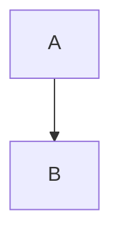
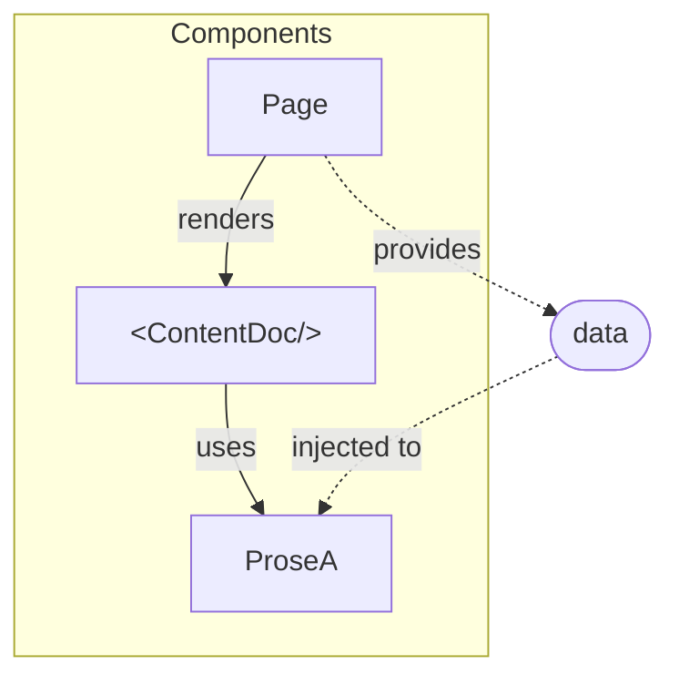

# Learn - Nuxt

Here you can find how we use nuxt to create static web pages.

To contribute please read [Contribution Guide](./contribution-guide.md).

## Pages Directory

You can create pages under `.theme/pages/`.

### Index Pages

Index pages are named `index.vue` and can be accessed without a route. For
example; `.theme/pages/demo/index.vue` is at `/demo`.

Demo is at [/demo](/demo).

### Static Routes

File name is automatically the route name e.g. `.theme/pages/demo/static.vue`
is at `/demo/static`

Demo is at [/demo/static](/demo/static).

### Dynamic Routes

To create a dynamic page you need to surround the page with '[]' e.g.
`.theme/pages/demo/[page].vue`. To make it optional surround it with `[[]]`
e.g. `.theme/pages/demo/optional/[[page]].vue`.

- Dynamic page demo:
  - [/demo/dynamic-1](/demo/dynamic-1)
  - [/demo/dynamic-2](/demo/dynamic-2)
- Optional route page demo:
  - [/demo/optional](/demo/optional)
  - [/demo/optional/dynamic](/demo/optional/dynamic)

## Content

Content of a web site is markdown files that are placed at the root of to give
focus on more to content than its theme layout.

### Content Page

Content page is a page that uses `<ContentDoc />` which renders given markdown
content as html. It is at `.theme/pages/[[content-page]].vue` which has a
dynamic route to handle any markdown file.

### Nuxt Content Plugin

With the [Nuxt Content](https://content.nuxtjs.org/) plugin you can read the
content of your markdown files by taking the content folder as the root path.

Don't forget to add `@nuxt/content` under modules in `nuxt.congfig.ts`

### Linking to Another Content Page

To link to another page, simply link to its markdown file in `[Link
to](other-file.md)` format as demonstrated below;

- [Other Content](other-content.md)

## Images

To serve static images simply put any `.ico` or `.png` file under
`.theme/images` folder. It will be served at the root path e.g.
`.theme/images/logo.png` will be at `/logo.png`.

Nuxt provides `public` folder for this, but we added that folder to
`.gitignore` because during preprocessing diagrams are copied to that folder as
well.

Demo is at [/demo/images](/demo/images).

## Mermaid Diagrams

We use a preprocessor to generate mermaid diagram images from markdown files.
Below is a demonstration of how to draw a diagram.

## Component

To create a component, create a vue file in `.theme/components` directory e.g.
`.theme/components/BasicComponent.vue`. Then use this component in a page as
shown in `./theme/pages/demo/basic-component.vue`.

Demo is at [/demo/basic-component](/demo/basic-component).

## Provide & Inject

When you need to access a data that cannot be passed to a component (such as
prose components), we use `provide` and `inject` functions. Basically you
`provide` a value in a parent component to be `inject`ed in any child
components.

Demo is at [/demo/provide-and-inject](/demo/provide-and-inject)

## Escape Curly Braces

To escape curly braces use `v-pre` as shown in
`.theme/pages/demo/escape-curly-braces.vue`.

Demo is at [/demo/escape-curly-braces](/demo/escape-curly-braces).

## Open Graph

With Open Graph, you can offer a preview of your site with given title,
description, image and url for the preview in your meta.

We can change meta in 2 ways in nuxt.

### In `nuxt.config.ts`

You can give the head of your page by default. You can find an example
in `.theme/nuxt.config.ts`.

To see this metadata, view source of this page.

### Using `useHead()`

To update the metas with `useHead()` you can access the head content from
your `.vue` files.

Demo is at [/demo/open-graph](/demo/open-graph)

To see the changes, go to [/demo/open-graph](/demo/open-graph) and view the
source code

## Preprocessing Markdown Files

We've built a task based `prebuild` mechanism to preprocess markdown files
before nuxt build. This was needed to have pure markdown content at the root of
the repository without the boilerplate code of a nuxt project.

### Clean

This task (`.theme/prebuild/tasks/clean.js`) deletes files with the given
parameters, including subfolders.

### Copy

This task (`.theme/prebuild/tasks/copy.js`) copies files with the given
extension to the desired location.

### Extract Diagrams

This task (`.theme/prebuild/tasks/extractDiagrams.js`) processes markdown files
and extracts diagrams as `.png` files and modifies markdowns to replace
markdown code with diagram images.

### Fix Links

This task (`.theme/prebuild/tasks/fixLinks.js`) demonstrates how you can
manipulate markdown files befor building. It removes `.md` extension from links
in markdown files so that they both work in markdown and published web site
correctly.

### Move

This task (`.theme/prebuild/tasks/move.js`) moves files with given extension
from source directory to target directory.

### Rename

This task (`.theme/prebuild/tasks/rename.js`) renames files with the given
name in the given location to the desired name in the same location.

### Replace Content

This task (`.theme/prebuild/tasks/replaceContent.js`) replaces given old text
to new text in files with given extension. We used this one to replace
`README.md` with `index.md` before fixing links.

## Base url

In nuxt, baseurl is the suffix you give to the end of your root url. For
example, if your root url is `mouseless.com` and your baseurl is `learn`, your
root url will be `mouseless.com/learn`.

## Enviroment File

It is usually a hidden file where we store our constant variables such as
`BASE_URL` for system settings. It can be customized as `.env.{profile}`.

### `.env.local`

This is where we host the config settings for developer mode.

### `.env.production`

This is where we host the config settings for production mode. Settings in
`.env.production` are used when deploying.
