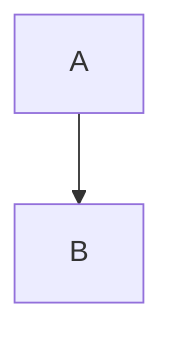

# Learn - Nuxt

Here you can find how we use nuxt to create static web pages.

To contribute please read [Contribution Guide](./contribution-guide.md).

For demo links to work, run this project in your local machine.

## Content

We use [Nuxt Content](https://content.nuxtjs.org/) to render markdown content
in a web page. Add `@nuxt/content` under modules in `.theme/nuxt.congfig.ts`

Markdown files are placed at the root of to give focus on more to content than
its theme layout.

### Links

To link to another page, simply link to its markdown file in `[Link
to](other-file.md)` format as demonstrated below;

[Content / Links](content/links.md)

### Images

To include an image in markdown, place image files in a folder named `-images`
at the same path as that markdown file. For example; if you have a file
`/demo/image-in-content.md`, place its images in `/demo/-images`.

Demo is at [Content / Images](content/images.md)

### Mermaid Diagrams

We use a preprocessor to generate mermaid diagram images from markdown files.
Below is a demonstration of how to draw a diagram;

## Pages

You can create pages under `.theme/pages/`.

### Index Pages

Index pages are named `index.vue` and can be accessed without a route. For
example; `.theme/pages/demo/index.vue` is at `/demo`.

Demo is at [/demo](/demo).

### Static Routes

File name is automatically the route name e.g. `.theme/pages/demo/static.vue`
is at `/demo/static`

Demo is at [/demo/static](/demo/static).

### Dynamic Routes

To create a dynamic page you need to surround the page with '[]' e.g.
`.theme/pages/demo/[page].vue`. To make it optional surround it with `[[]]`
e.g. `.theme/pages/demo/optional/[[page]].vue`. To have a dynamic route that
can handle any depth in a path we use catch all routes e.g.
`.theme/pages/demo/catch-all/[...page].vue`.

- Dynamic route:
  - [/demo/dynamic-1](/demo/dynamic-1)
  - [/demo/dynamic-2](/demo/dynamic-2)
- Dynamic route with optional parameter:
  - [/demo/optional](/demo/optional)
  - [/demo/optional/dynamic](/demo/optional/dynamic)
- Catch all route:
  - [/demo/catch-all](/demo/catch-all)
  - [/demo/catch-all/dynamic](/demo/catch-all/dynamic)
  - [/demo/catch-all/with/a/sub/dir](/demo/catch-all/with/a/sub/dir)

### Content Page

Content page is a page that uses `<ContentDoc />` which renders given markdown
content as html. It is at `.theme/pages/[...content-page].vue` which has a
catch all route to handle any markdown file in any directory.

## Public Assets

To serve static assets in a theme like `.css` or `.png` files simply put any
file under `.theme/public` folder. It will be served at the root path. E.g.
`.theme/public/logo.png` will be at `/logo.png`.

Demo is at [/demo/public-assets](/demo/public-assets).

> :information_source:
>
> `.png` from content images or generated diagrams should be served under
> `.theme/public` but they shouldn't be included in git. To preserve the
> default behaviour while solving this problem, we change public assets folder
> from `.theme/public` to `.theme/.public` via `vite.publicDir` in
> `.theme/nuxt.config.ts` and copy public assets, content images and generated
> diagrams into `.public` during preprocessing.

## Components

Components are reusable pieces which can be created manually using built in
components. Creating components gives you flexibility in designing your UI.
To create a component, create a vue file in `.theme/components` directory.

### Basic Component

Basic component is our understanding of a component in its simplest form,
to create a basic component create the vue file `BasicComponent.vue` in
`.theme/components` directory. To create more complex components this base
component can be used as a starting point. Then use this component in a page
as shown in `./theme/pages/demo/basic.vue`.

Demo is at [/demo/components/basic](/demo/components/basic).

### Defining Properties

To add properties to a component, `defineProps` can be used and type and default
value can be set as shown in `./theme/components/ComponentWithProps.vue`. More
properties can be added later on. Values of these properties can be assigned
when using the component with properties as shown in
`./theme/demo/defining-props.vue`

Demo is at [/demo/components/defining-props](/demo/components/defining-props)

### Prose

Prose components are wrappers of html tags that are used to render markdown
content. When you want to change the way nuxt renders markdown you need to
override a prose component.

To override a prose, let's say `<table>`, browse to [Nuxt Content /
Prose](https://github.com/nuxt/content/blob/main/src/runtime/components/Prose/)
and copy corresponding component, `ProseTable.vue` in this case, and place it
under exactly the same path `.theme/components/Prose/`, and make any change you
want.

Below is a demonstration of overriding `ProseTable.vue`;

| Override | This  | Table      |
| ---      | ---   | ---        |
| Using    | Prose | Components |
| To       | Add   | Border     |

> :information_source:
>
> You need to configure `~/components/Prose` as a global directory to enable
> this. See `.theme/nuxt.config.ts`.

### Slot Manipulation

We need this one to create an alarm component out of a blockquote with an icon
in its first line like below;

> :warning:
>
> Demo warning message

Content of this blockquote is passed to `ProseBlockquote` component in
`<slot/>`. To parse the first line of this slot, we used `useSlots` in script
where nuxt gives access to element tree of a markdown content.

`<slot/>` does not allow to manipulate its content, so we used `<component
:is="..."/>` instead. This is the way to render a slot that is programmatically
changed or created.

Other types demonstrated below;

> :information_source:
>
> Demo info message

> Demo default message

### Disabling Emoji Conversion

Nuxt content comes with a default setting that converts emoji texts into emoji
icons. This is disabled in `.theme/nuxt.config.ts` under
`content.markdown.remarkPlugins.remark-emoji`. This way a prose component gets
original text instead of an emoji icon which is better because we don't want to
place an emoji icon in code.

## Provide & Inject

When you need to access a data that cannot be passed to a component (such as
prose components), we use `provide` and `inject` functions. Basically you
`provide` a value in a parent component to be `inject`ed in any child
components.

Demo is at [/demo/provide-and-inject](/demo/provide-and-inject)

## Escape Curly Braces

To escape curly braces use `v-pre` as shown in
`.theme/pages/demo/escape-curly-braces.vue`.

Demo is at [/demo/escape-curly-braces](/demo/escape-curly-braces).

## Open Graph

With Open Graph, you can offer a preview of your site with given title,
description, image and url for the preview in your meta.

We can change meta in 2 ways in nuxt.

### In `nuxt.config.ts`

You can give the head of your page by default. You can find an example
in `.theme/nuxt.config.ts`.

To see this metadata, view source of this page.

### Using `useHead()`

To update the metas with `useHead()` you can access the head content from
your `.vue` files.

Demo is at [/demo/open-graph](/demo/open-graph)

To see the changes, go to [/demo/open-graph](/demo/open-graph) and view the
source code

## Preprocessing Markdown Files

We've built a task based `prebuild` mechanism to preprocess markdown files
before nuxt build. This was needed to have pure markdown content at the root of
the repository without the boilerplate code of a nuxt project.

### Clean

This task (`.theme/prebuild/tasks/clean.js`) deletes files with the given
parameters, including subfolders.

### Copy

This task (`.theme/prebuild/tasks/copy.js`) copies files with the given
extension to the desired location.

### Extract Diagrams

This task (`.theme/prebuild/tasks/extractDiagrams.js`) processes markdown files
and extracts diagrams as `.png` files and modifies markdowns to replace
markdown code with diagram images.

### Fix Links

This task (`.theme/prebuild/tasks/fixLinks.js`) demonstrates how you can
manipulate markdown files befor building. It removes `.md` extension from links
in markdown files so that they both work in markdown and published web site
correctly.

### Move

This task (`.theme/prebuild/tasks/move.js`) moves files with given extension
from source directory to target directory.

### Rename

This task (`.theme/prebuild/tasks/rename.js`) renames files with the given
name in the given location to the desired name in the same location.

### Replace Content

This task (`.theme/prebuild/tasks/replaceContent.js`) replaces given old text
to new text in files with given extension. We used this one to replace
`README.md` with `index.md` before fixing links.
