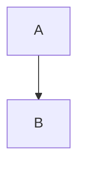
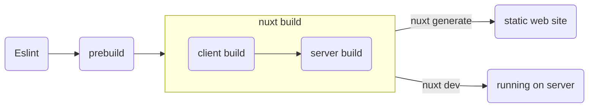

# Learn - Nuxt

Here you can find how we use nuxt to create static web pages.

To contribute please read [Contribution Guide](./CONTRIBUTING.md).

For demo links to work, run this project in your local machine. Please read
our [Setup Guide](./setup-guide.md) before running the application.

## Content

We use [Nuxt Content](https://content.nuxtjs.org/) to render markdown content
in a web page. Add `@nuxt/content` under modules in `.theme/nuxt.congfig.ts`

Markdown files are placed at the root of to give focus on more to content than
its theme layout.

### Conventions

We follow certain guidelines when creating new or adding/editing content on
existing markdown files. The aim is keeping the markdown files consistent in
itself. Links, images etc. should be working on any platform this markdown file
is viewed, such as GitHub. Below is the list of our conventions, the ones that
require more explanation are explained in their own sections below.

- Line lengths sould be less or equal to 80 characters
- Indentantions are two space, don't use tab indentation
- Empty line before and after every Code Block, Image, Link, Mermaid Diagram,
  Alert / Info / Tip Boxes, Header etc.
- Table rows should have the same width.

### Code Blocks

Code references are given in code block such as `const x = ref(5);`. To use
code block wrap the code with "\`" character. This usage works for a single
line, in order to have multiple lines of code block use "\`\`\`" instead of "\`".

> :information_source:
>
> Code related terms and terms in general are not given in code block,
> use "\_\_Term\_\_" for code related terms, and italic for terms in general.

### Alert / Info / Tip Box

We use these boxes to give information, warning or tips when it is related to
the context but could not be included in the paragraph.

| Box Type | Markdown Name        |
| ---      | ---                  |
| Alert    | :warning:            |
| Info     | :information_source: |
| Tip      | :bulb:               |

### Links

To link to another page, simply link to its markdown file in `[Link
to](other-file.md)` format as demonstrated below;

[Content / Links](content/links.md)

### Images

To include an image in markdown, place image files in a folder named `-images`
at the same path as that markdown file. For example; if you have a file
`/content/images.md`, place its images in `/content/-images`.

Demo is at [Content / Images](content/images.md)

### Mermaid Diagrams

We use a preprocessor to generate mermaid diagram images from markdown files.
Below is a demonstration of how to draw a diagram;

## Pages

You can create pages under `.theme/pages/`.

### Index Pages

Index pages are named `index.vue` and can be accessed without a route. For
example; `.theme/pages/demo/index.vue` is at `/demo`.

Demo is at [/demo](/demo).

### Static Routes

File name is automatically the route name e.g. `.theme/pages/demo/static.vue`
is at `/demo/static`

Demo is at [/demo/static](/demo/static).

### Dynamic Routes

To create a dynamic page you need to surround the page with '[]' e.g.
`.theme/pages/demo/[page].vue`. To make it optional surround it with `[[]]`
e.g. `.theme/pages/demo/optional/[[page]].vue`. To have a dynamic route that
can handle any depth in a path we use catch all routes e.g.
`.theme/pages/demo/catch-all/[...page].vue`.

- Dynamic route:
  - [/demo/dynamic-1](/demo/dynamic-1)
  - [/demo/dynamic-2](/demo/dynamic-2)
- Dynamic route with optional parameter:
  - [/demo/optional](/demo/optional)
  - [/demo/optional/dynamic](/demo/optional/dynamic)
- Catch all route:
  - [/demo/catch-all](/demo/catch-all)
  - [/demo/catch-all/dynamic](/demo/catch-all/dynamic)
  - [/demo/catch-all/with/a/sub/dir](/demo/catch-all/with/a/sub/dir)

### Content Page

Content page is a page that uses `<ContentDoc />` which renders given markdown
content as html. It is at `.theme/pages/[...content-page].vue` which has a
catch all route to handle any markdown file in any directory.

#### Document-Driven Mode

We don't use document-driven mode in nuxt projects even if it's a website that
contains only markdown content. This is because all it does is to register a
page with catch-all route along with extra queries like `navigation`,
`surround` which could be unncessary in your theme. If you need to render
navigation menu etc., use `<ContentQuery>` or `queryContent()` queries.

> :warning:
>
> This project contains pages without a corresponding markdown content under
> `/demo` path. When you enable document-driven mode, dynamic pages under
> `/demo` will not work.

### Querying with `queryContent`

We needed to load all markdown content under a folder in one page. To achieve
this we used `queryContent` by which you can retrieve content under `content/`
folder.

> :information_source:
>
> `find`, `findOne` methods return `promise` so you need to wait with `await`.

Demo is at [/demo/query-content](/demo/query-content)

> :warning:
>
> We've disabled `navigation` and `surround` options to avoid extra queries
> when a page is loaded. You might reenable these depending on the theme you
> are using.

### Querying with `<ContentQuery>`

We needed to load all markdown content under a folder on a single page. When
there is no need to change the data we receive with `queryContent` in the
script block, the query sent to the content with `<ContentQuery>` was made to
reduce the crowd in the script.

Demo is at [/demo/content-query](/demo/content-query)

### Trailing Slash Problem Workaround

Nuxt generates an `index.html` file under each route and this causes some
static site hosting services, such as GitHub Pages, to add a trailing slash to
urls. When this happens that page fails to load resources with a relative path
because a trailing slash would indicate another directory in a path.

To workaround this, we've added a script that checks if `route.path` has a
trailing slash upon mounting. We know that this is not the best solution, but
for now this is the workaround we use.

> :warning:
>
> For this solution to work correctly, you need to enable
> `router.options.strict` in `.theme/nuxt.config.ts` so that a path with a
> trailing slash is not treated as same as a path without a trailing slash.
> Otherwise `navigateTo` does not redirect and throws an error.

Solution is in `.theme/app.vue`.

## Layout

We used layout to seperate header and sidebar components from pages. For nuxt
to recognize layouts, they should be implemented in `.theme/layout` folder. To
create a layout create a `default.vue` in the layout folder. Our implementation
is at `.theme/layout/default.vue`. For layout to be used in every page it needs
to be added to `app.vue` as shown in `.theme/app.vue`.

## Public Assets

To serve static assets in a theme like `.css` or `.png` files simply put any
file under `.theme/public` folder. It will be served at the root path. E.g.
`.theme/public/logo.png` will be at `/logo.png`.

Demo is at [/demo/public-assets](/demo/public-assets).

> :information_source:
>
> `.png` from content images or generated diagrams should be served under
> `.theme/public` but they shouldn't be included in git. To preserve the
> default behaviour while solving this problem, we change public assets folder
> from `.theme/public` to `.theme/.public` via `dir.public` in
> `.theme/nuxt.config.ts` and copy public assets, content images and generated
> diagrams into `.public` during preprocessing.

## Variable

Variables can be created as shown in `.theme/pages/demo/variable`.

Demo is at [/demo/variable](/demo/variable).

> :information_source:
>
> We are using __Composition__ __API__ with setup in nuxt and in demos.

## Computed

Computed properties can be created as shown in
`.theme/pages/demo/computed/index.vue`.

Demo is at [/demo/computed](/demo/computed).

> :information_source:
>
> Computed properties are evaluated only once while functions will be
> re-evaluated every time they are called.

### With Ref

Ref can be used with computed properties, this results in an automatic
re-rendering after a single re-evaluation when dependencies have changed. Ref
can be used in computed properties as shown in
`.theme/pages/demo/computed/with-ref.vue`

Demo is at [/demo/computed/with-ref](/demo/computed/with-ref)

## Components

Components are reusable pieces which can be created manually using built in
components. Creating components gives you flexibility in designing your UI.
To create a component, create a vue file in `.theme/components` directory.

### Basic Component

Basic component is our understanding of a component in its simplest form,
to create a basic component create the vue file `BasicComponent.vue` in
`.theme/components` directory. To create more complex components this base
component can be used as a starting point. Then use this component in a page
as shown in `.theme/pages/demo/basic.vue`.

Demo is at [/demo/components/basic](/demo/components/basic).

### Defining Properties

To add properties to a component, `defineProps` can be used and type and default
value can be set as shown in `./theme/components/ComponentWithProps.vue`. More
properties can be added later on. Values of these properties can be assigned
when using the component with properties as shown in
`.theme/demo/defining-props.vue`

Demo is at [/demo/components/defining-props](/demo/components/defining-props)

### Emit & Ref

Emit is the way to raise events from a component to its parent, like a click
event. Ref is used for reactivity, so when a state is expected to change use
`ref` for changes to apply to the template immediately.

Demo is at [/demo/components/emit-and-ref](/demo/components/emit-and-ref)

### Prose

Prose components are wrappers of html tags that are used to render markdown
content. When you want to change the way nuxt renders markdown you need to
override a prose component.

To override a prose, let's say `<table>`, browse to [Nuxt Content /
Prose](https://github.com/nuxt/content/blob/main/src/runtime/components/Prose/)
and copy corresponding component, `ProseTable.vue` in this case, and place it
under exactly the same path `.theme/components/Prose/`, and make any change you
want.

Below is a demonstration of overriding `ProseTable.vue`;

| Override | This  | Table      |
| ---      | ---   | ---        |
| Using    | Prose | Components |
| To       | Add   | Border     |

> :information_source:
>
> You need to configure `~/components/Prose` as a global directory to enable
> this. See `.theme/nuxt.config.ts`.

### Slot Manipulation

We need this one to create an alarm component out of a blockquote with an icon
in its first line like below;

> :warning:
>
> Demo warning message

Content of this blockquote is passed to `ProseBlockquote` component in
`<slot/>`. To parse the first line of this slot, we used `useSlots` in script
where nuxt gives access to element tree of a markdown content.

`<slot/>` does not allow to manipulate its content, so we used `<component
:is="..."/>` instead. This is the way to render a slot that is programmatically
changed or created.

Other types demonstrated below;

> :information_source:
>
> Demo info message

> Demo default message

### Disabling Emoji Conversion

Nuxt content comes with a default setting that converts emoji texts into emoji
icons. This is disabled in `.theme/nuxt.config.ts` under
`content.markdown.remarkPlugins.remark-emoji`. This way a prose component gets
original text instead of an emoji icon which is better because we don't want to
place an emoji icon in code.

## Provide & Inject

When you need to access a data that cannot be passed to a component (such as
prose components), we use `provide` and `inject` functions. Basically you
`provide` a value in a parent component to be `inject`ed in any child
components.

Demo is at [/demo/provide-and-inject](/demo/provide-and-inject)

## Escape Curly Braces

To escape curly braces use `v-pre` as shown in
`.theme/pages/demo/escape-curly-braces.vue`.

Demo is at [/demo/escape-curly-braces](/demo/escape-curly-braces).

## Open Graph

With Open Graph, you can offer a preview of your site with given title,
description, image and url for the preview in your meta.

We can change meta in 2 ways in nuxt.

### In `nuxt.config.ts`

You can give the head of your page by default. You can find an example
in `.theme/nuxt.config.ts`.

To see this metadata, view source of this page.

### Using `useHead()`

To update the metas with `useHead()` you can access the head content from
your `.vue` files.

Demo is at [/demo/open-graph](/demo/open-graph)

To see the changes, go to [/demo/open-graph](/demo/open-graph) and view the
source code

## Runtime Config

These are the config settings passed to runtime during build.
In the `nuxt-content` plugin we use it to set the depth of anchor links
and to access our config settings like `baseURL` from pages and components.
See `.theme/nuxt.config.ts` for definition examples and
`.theme/pages/demo/runtime-config.vue` for usage example.

Demo is at [/demo/runtime-config](/demo/runtime-config)

## Build Process

The building process has 4 stages. The first stage is lint checking using
eslint. Second stage is prebuild, markdowns are preprocessed in this stage.
You can check the [prebuild](/prebuild). Third stage is build. Fourth stage
is divided into two parts, creating a static site for deployement or running
the built site from third stage in development mode. To create a static site
we use `nuxt generate`, to run the project in development mode we use
`nuxt dev`.

## Base url

In nuxt, baseurl is the suffix you give to the end of your root url. For
example, if your root url is `mouseless.codes` and your baseurl is `learn`, your
root url will be `mouseless.codes/learn`.

Base url should be given to `app.baseURL` when using it in the nuxt project.
Note that the base url must start with `/`. We always put `/` at the beginning
to avoid this requirement. You can find an example in `.theme/nuxt.config.ts`.
