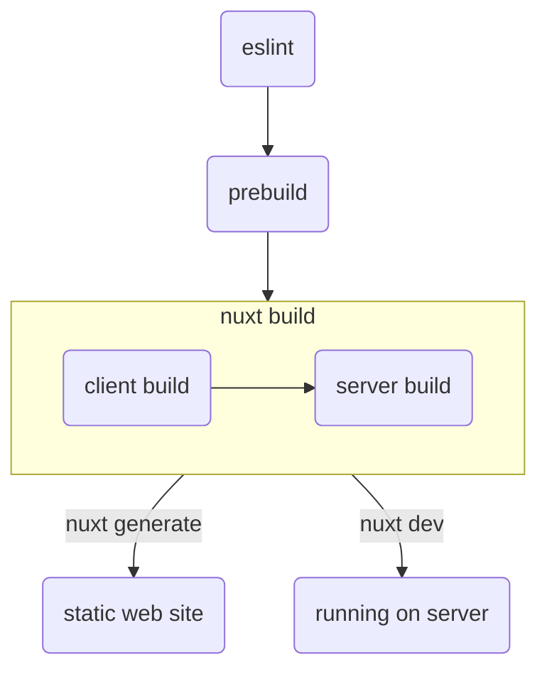

# Build & Run

To create a static site we use `nuxt generate`, to run the project in
development mode we use `nuxt dev`.

For unix-like systems use `Makefile`;

```bash
make build
make run
```

For Windows systems use `build.bat`;

```bash
.\build.bat
.\run.bat
```

## Process

Process consists of 4 stages;

1. Lint checking using eslint
1. [Prebuild][], markdowns are preprocessed in this stage
1. Nuxt build
1. Last stage differs between `build` & `run`
   1. When building, it creates a static site for deployment
   1. When running locally, it runs application in development mode



## `package.json` Configuration

We configure build/run commands with the scripts in the `package.json` that we
edit to run processes such as [Eslint][], [Prebuild][].

### Argument Passing/Parsing

We took help from arguments to reduce repetitive steps and to improve with
parameters in scripts. Look at `.theme/package.json` to see use.

We used [cross-var](https://www.npmjs.com/package/cross-var) to avoid using
different syntax for different operating systems.

### npx

npx kullanımının açıklaması buraya gelecek...

[Eslint]: https://eslint.org/
[Prebuild]: https://github.com/mouseless/prebuild