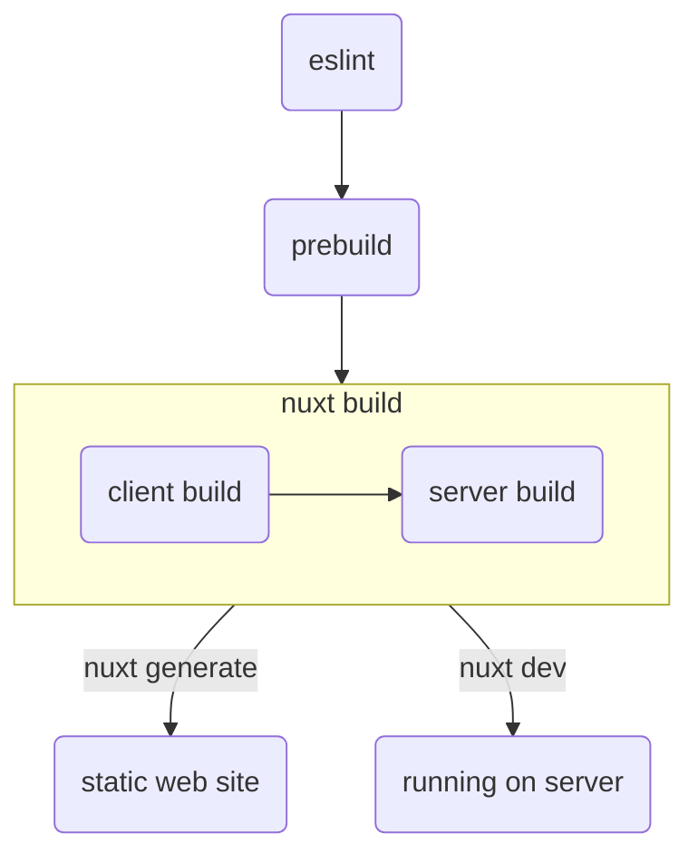

# Build & Run

To create a static site we use `nuxt generate`, to run the project in
development mode we use `nuxt dev`.

For unix-like systems use `Makefile`;

```bash
make build
make run
```

For Windows systems use `build.bat`;

```bash
.\build.bat
.\run.bat
```

## Process

Process consists of 4 stages;

1. Lint checking using eslint
1. [Prebuild][], markdowns are preprocessed in this stage
1. Nuxt build
1. Last stage differs between `build` & `run`
   1. When building, it creates a static site for deployment
   1. When running locally, it runs application in development mode



[Prebuild]: https://github.com/mouseless/prebuild