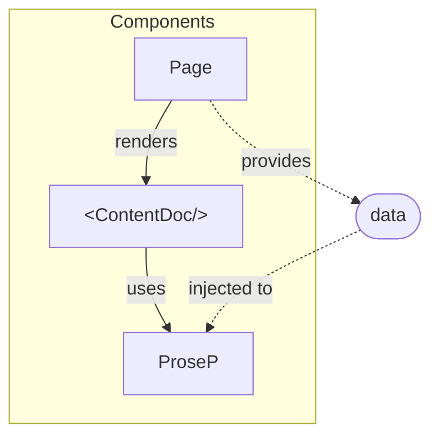

# Components

Components are reusable pieces which can be created manually using built in
components. Creating components gives you flexibility in designing your UI.
To create a component, create a vue file in `.theme/components` directory.

## Basic Component

Basic component is our understanding of a component in its simplest form,
to create a basic component create the vue file `BasicComponent.vue` in
`.theme/components` directory. To create more complex components this base
component can be used as a starting point. Then use this component in a page
as shown in `.theme/pages/demo/basic.vue`.

Demo is at [/demo/components/basic](/demo/components/basic).

## Defining Properties

To add properties to a component, `defineProps` can be used and type and default
value can be set as shown in `./theme/components/ComponentWithProps.vue`. More
properties can be added later on. Values of these properties can be assigned
when using the component with properties as shown in
`.theme/demo/defining-props.vue`

> :information_source:
>
> When we use `defineProps`, we prefer the language to be `typescript` to keep
> the props type-safe.

Demo is at [/demo/components/defining-props](/demo/components/defining-props)

### Complex Type Props

Complex types can be used with `defineProps` as seen in
`./theme/components/ComponentWithTypedProp.vue`.

Demo is at
[/demo/components/complex-type-props](/demo/components/complex-type-props)

> :information_source:
>
> For type instances in your scripts to work, script language should be set
> to TypeScript. [TypeCheck][] should be enabled. If you have enabled type
> checking in your project required properties are enforced during compile.

### Reusing Types

To reuse types, create a `types` folder at the root of the project, and create
an `index.ts` file to export types. You can add your types in this folder and
export them via `index.ts`, see `./theme/types/Demo.ts`. These types can be
used in components as seen in `./theme/components/ComponentThatReusesType.vue`

Demo is at [/demo/components/reusing-types](/demo/components/reusing-types)

## Emit & Ref

Emit is the way to raise events from a component to its parent, like a click
event. Ref is used for reactivity, so when a state is expected to change use
`ref` for changes to apply to the template immediately.

Demo is at [/demo/components/emit-and-ref](/demo/components/emit-and-ref)

## Global Emit

To emit a global change, we use nuxt's state management. To achieve this;

1. Introduce a state with its default value function as shown in
   `.theme/composables/states.js`
1. Import and modify it as shown in
   `.theme/components/ComponentThatEmitsGlobally.vue`
1. Watch it as shown in `.theme/pages/demo/components/global-emit.vue`

Demo is at [/demo/components/global-emit](/demo/components/global-emit)

## Prose

Prose components are wrappers of html tags that are used to render markdown
content. When you want to change the way nuxt renders markdown you need to
override a prose component.

To override a prose, let's say `<table>`, go to the
[Nuxt Content](https://content.nuxt.com/components/prose) page and find the
source code of the component on github, in this case `ProseTable`. Copy the
code from there, and place it under exactly the same path
`.theme/components/Prose/`, and make any change you want.

Below is a demonstration of overriding `ProseTable.vue`;

| Override | This  | Table      |
| ---      | ---   | ---        |
| Using    | Prose | Components |
| To       | Add   | Border     |

> :information_source:
>
> You need to configure `~/components/Prose` as a global directory to enable
> this. See `.theme/nuxt.config.ts`.

## Slot Manipulation

We need this one to create an alarm component out of a blockquote with an icon
in its first line like below;

> :warning:
>
> Demo warning message

Content of this blockquote is passed to `ProseBlockquote` component in
`<slot/>`. To parse the first line of this slot, we used `useSlots` in script
where nuxt gives access to element tree of a markdown content.

`<slot/>` does not allow to manipulate its content, so we used `<component
:is="..."/>` instead. This is the way to render a slot that is programmatically
changed or created.

Other types demonstrated below;

> :information_source:
>
> Demo info message

> Demo default message

## Provide & Inject

When you need to access a data that cannot be passed to a component (such as
prose components), we use `provide` and `inject` functions. Basically you
`provide` a value in a parent component to be `inject`ed in any child
components.

Demo is at [/demo/provide-and-inject](/demo/provide-and-inject)

[TypeCheck]: https://nuxt.com/docs/api/configuration/nuxt-config#typecheck

## Content Transformer

We use Content Transformers when we want to manipulate the html content of a
markdown content before it is rendered, after it is parsed.

See [/demo/transformer](/demo/transformer/) to see what can be done.

See `/transformers/optimus-prime.ts` to see how it is done.

> :information_source:
>
> For Content Transformers to work, we need to add them as modules to Nuxt.
> Nuxt does this automatically if the nuxt modules are under `/modules`. You
> can see how to add them as modules in `/modules/transform-module.ts`.

## Pinia

We use [Pinia][pinia] when we try to fetch the same data multiple times. For
example, let's say we use the same titles for the items in the header, footer
and side menu. With Pinia, we can fetch the data once and distribute it to other
components.

See [/store/piniaStore](/store/piniaStore.js) for the pinia store where we store
the fetched data.

See [demo/pinia](/demo/pinia) for demo of how we use the Pinia store to add and
import data.

[pinia]: https://pinia.vuejs.org/ssr/nuxt.html
