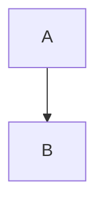

# Content

We use [Nuxt Content](https://content.nuxtjs.org/) to render markdown content
in a web page. Add `@nuxt/content` under modules in `.theme/nuxt.congfig.ts`

Markdown files are placed at the root of to give focus on more to content than
its theme layout.

## Conventions

We follow certain guidelines when creating new or adding/editing content on
existing markdown files. The aim is keeping the markdown files consistent in
itself. Links, images etc. should be working on any platform this markdown file
is viewed, such as GitHub. Below is the list of our conventions, the ones that
require more explanation are explained in their own sections below.

- Line lengths sould be less or equal to 80 characters
- Indentantions are two space, don't use tab indentation
- Empty line before and after every Code Block, Image, Link, Mermaid Diagram,
  Alert / Info / Tip Boxes, Header etc.
- Table rows should have the same width.
- We have disabled emoji conversion, use actual emoji icons.

## Code Blocks

Code references are given in code block such as `const x = ref(5);`. To use
code block wrap the code with "\`" character. This usage works for a single
line, in order to have multiple lines of code block use "\`\`\`" instead of "\`".

> :information_source:
>
> Code related terms and terms in general are not given in code block,
> use "\_\_Term\_\_" for code related terms, and italic for terms in general.

## Alert / Info / Tip Box

We use these boxes to give information, warning or tips when it is related to
the context but could not be included in the paragraph.

| Box Type | Markdown Name        |
| ---      | ---                  |
| Alert    | :warning:            |
| Info     | :information_source: |
| Tip      | :bulb:               |

## Links

To link to another page, simply link to its markdown file in `[Link
to](other-file.md)` format as demonstrated below;

[Content / Links](content/links.md)

## Images

To include an image in markdown, place image files in a folder named `-images`
at the same path as that markdown file. For example; if you have a file
`/content/images.md`, place its images in `/content/-images`.

Demo is at [Content / Images](content/images.md)

## Mermaid Diagrams

We use a preprocessor to generate mermaid diagram images from markdown files.
Below is a demonstration of how to draw a diagram;

